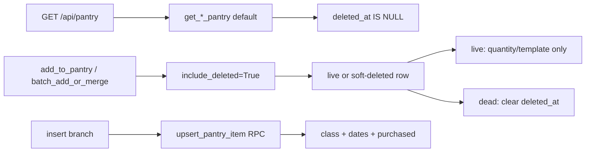

# Pantry Trust Step 1 — Rows Become Scorable

> **Prerequisite:** Read the parent plan at `.cursor/plans/pantry_trust_mvp_496b56a4.plan.md` (Step 1 section only). Latest applied migration before this brief is `026_revoke_anon_table_grants.sql`. Schema source of truth: `supabase/migrations/`.
>
> **Scope:** Five backend service files, one new migration (`027_pantry_depletion_fields_and_backfill.sql`), and the tests named below. No frontend. Ship as **one commit** (C1 blocking hazard: class backfill without `quantity_purchased` activates the UNIT_ITEM wipe path on first cook).
>
> **Do NOT touch in this slice:** `frontend/`, `POST /pantry/cook` response shape / `touched` / pool swipe (Step 2), `process_cook_event` household scope or `find_pantry_match_for_cook` (Step 2), `suggestion_service.py` health-card loop (resolver lives inside `compute_confidence`), `run_expiry_cleanup` / `hard_expire_date`, unifying the two merge keys (`base+variant+unit` in `add_to_pantry` vs base-only in `batch_add_or_merge_items`).

---

## Objective

Make pantry rows scorable on ingest so GET pantry, dinner ranking, and cook no longer operate on empty `depletion_class` / missing purchase metadata. Fix two contradictions in the parent plan that would block an implementer:

1. **Merge vs GET filter:** Adding `.is_("deleted_at", "null")` to the pantry getters while resurrecting in merge requires a **second lookup that includes soft-deleted rows**, used only by merge/resurrect — not by GET pantry.
2. **Insert plumbing:** Both insert paths call `SupabaseService.upsert_pantry_item`, which still uses PostgREST `.upsert(on_conflict=...)` against partial unique indexes. Migration 025 ships `public.upsert_pantry_item(jsonb)` as the replacement, but its column list omits the four depletion fields. Switching without extending the RPC silently drops `_depletion_fields`.

After this slice, a freshly inserted UNIT_ITEM scores **0.90** (C3), and a UNIT_ITEM from the real insert path survives its first cook with `quantity_remaining == quantity_purchased - 1` and is **not** soft-deleted (C1).



---

## Why resurrect is still required (correcting the parent plan)

The parent plan says resurrect is required because "the unique index still holds the slot." That is **wrong after migration 024**. Live uniqueness is partial:

```sql
-- supabase/migrations/024_postgres_best_practices_hardening.sql:787-795
CREATE UNIQUE INDEX unique_household_ingredient_variant
  ON pantry_items (household_id, base_ingredient, variant, unit)
  WHERE household_id IS NOT NULL AND deleted_at IS NULL;
```

A soft-deleted row does **not** block a new insert. The actual failure mode without resurrect:

- Merge loads live-only pantry → dead row invisible → insert creates a **second live row**
- Original graveyard row remains soft-deleted
- `process_put_back` later clears `deleted_at` on the old row and hits the unique index (`confidence_engine.py:559`)

Required behavior: **resurrect the same row** (clear `deleted_at`, refresh `purchase_date`, floor quantity), never insert a duplicate live row.

---

## Technical Contract

### 1. Live vs merge lookups — `backend/services/supabase_service.py` and `backend/services/pantry_service.py`

#### 1a. Pantry getters (modified)

Keep existing method names. Add keyword-only `include_deleted`:

```python
def get_user_pantry(self, user_id: str, *, include_deleted: bool = False) -> List[Dict]:
def get_household_pantry(self, household_id: str, *, include_deleted: bool = False) -> List[Dict]:
```

Both keep `.gt("quantity", 0)` and existing ordering. When `include_deleted` is **False** (default), add `.is_("deleted_at", "null")`. When **True**, omit that filter.

**Callers that must stay on default (live-only):** `get_pantry_summary`, suggestion/dinner/meal-plan/recipe/depletion readers via `_get_pantry_items()`, `GET /api/pantry`, health card item load.

**Callers that must use include-deleted:** `add_to_pantry`, `batch_add_or_merge_items` only.

#### 1b. `_get_pantry_items` (modified)

Add `include_deleted: bool = False` and forward the flag **only when True** so existing tests keep `assert_called_once_with(household_id)` without the kwarg:

```python
def _get_pantry_items(
    self,
    user_id: str,
    household_id: Optional[str] = None,
    *,
    today: Optional[date] = None,
    include_deleted: bool = False,
) -> List[Dict]:
    _ = today
    if household_id:
        if include_deleted:
            return self.supabase.get_household_pantry(household_id, include_deleted=True)
        return self.supabase.get_household_pantry(household_id)
    if include_deleted:
        return self.supabase.get_user_pantry(user_id, include_deleted=True)
    return self.supabase.get_user_pantry(user_id)
```

- `add_to_pantry`: replace `self._get_pantry_items(user_id, household_id)` with `self._get_pantry_items(user_id, household_id, include_deleted=True)`.
- `batch_add_or_merge_items`: same for the initial `working = list(...)`.

#### 1c. `get_receipt` (new on `SupabaseService`)

`process_receipt` loads receipt items but never the receipt row. Add:

```python
def get_receipt(self, receipt_id: str) -> Optional[Dict]:
```

Same admin/anon client selection as `get_receipt_items`. Query: `table("receipts").select("*").eq("id", receipt_id).limit(1).execute()`. Return first row or `None`.

---

### 2. `upsert_pantry_item` — switch to RPC and persist depletion fields

#### 2a. `SupabaseService.upsert_pantry_item` (rewrite)

Replace PostgREST `.upsert(..., on_conflict=...)` with the RPC contract already encoded in three **red today** tests in `tests/backend/test_services/test_supabase_service.py`:

- If `self.admin_client` is **None**, raise `DatabaseException` whose message includes `SUPABASE_SERVICE_ROLE_KEY`. Do **not** fall back to `self.client`.
- Call `self.admin_client.rpc("upsert_pantry_item", {"p_item": item_data}).execute()`.
- Return `response.data` as the scalar uuid (tests stub `"pantry-1"`), **not** `response.data[0]["id"]`.
- Remove `on_conflict` string construction entirely.

#### 2b. Migration `027_pantry_depletion_fields_and_backfill.sql`

**File name:** `027_pantry_depletion_fields_and_backfill.sql` (**not** 026 — `026_revoke_anon_table_grants.sql` exists).

**Part A — `CREATE OR REPLACE FUNCTION public.upsert_pantry_item(p_item jsonb)`** (before backfill statements)

Start from the 025 function body ([`025_postgres_review_followups.sql`](../../supabase/migrations/025_postgres_review_followups.sql)). Keep `SECURITY DEFINER`, `SET search_path = ''`, and service_role-only grants.

Add four columns to **both** INSERT column lists and VALUES (household branch and null-household branch):

| JSON key | SQL expression | Column type |
|---|---|---|
| `depletion_class` | `NULLIF(trim(p_item->>'depletion_class'), '')` | TEXT (CHECK) |
| `purchase_date` | `(p_item->>'purchase_date')::timestamptz` | TIMESTAMPTZ (014) |
| `available_until` | `(p_item->>'available_until')::date` | DATE (017) |
| `quantity_purchased` | `(p_item->>'quantity_purchased')::numeric` | DECIMAL(10,2) (017) |

Append to **both** `ON CONFLICT ... DO UPDATE SET` blocks (after existing fields, before `updated_at = now()`):

```sql
depletion_class = COALESCE(public.pantry_items.depletion_class, EXCLUDED.depletion_class),
purchase_date = COALESCE(public.pantry_items.purchase_date, EXCLUDED.purchase_date),
available_until = COALESCE(public.pantry_items.available_until, EXCLUDED.available_until),
quantity_purchased = COALESCE(public.pantry_items.quantity_purchased, EXCLUDED.quantity_purchased),
```

**Never** reference `quantity_remaining`, `deleted_at`, or `hard_expire_date` anywhere in this function.

Service-layer live merge already bypasses the RPC (`update_pantry_quantity` / `update_pantry_item_fields`). The conflict branch only fires on a race or the disagreeing merge keys; COALESCE-preserving updates prevent clobbering an existing class or purchased quantity.

**Part B — backfill** (four statements, run after function replace)

Never touch `quantity_remaining`, `hard_expire_date`, or `deleted_at`.

```sql
-- 1. depletion_class: NULL rows only
UPDATE pantry_items pi
SET depletion_class = COALESCE(ic.depletion_class, 'STAPLE')
FROM item_classification ic
WHERE pi.depletion_class IS NULL
  AND ic.item_name = pi.base_ingredient;

UPDATE pantry_items
SET depletion_class = 'STAPLE'
WHERE depletion_class IS NULL;

-- 2. purchase_date
UPDATE pantry_items
SET purchase_date = added_at
WHERE purchase_date IS NULL;

-- 3. available_until (PERISHABLE + shelf_life_days)
UPDATE pantry_items pi
SET available_until = (pi.purchase_date::date + ic.shelf_life_days)
FROM item_classification ic
WHERE pi.available_until IS NULL
  AND pi.depletion_class = 'PERISHABLE'
  AND ic.item_name = pi.base_ingredient
  AND ic.shelf_life_days IS NOT NULL
  AND pi.purchase_date IS NOT NULL;

-- 4. quantity_purchased
UPDATE pantry_items
SET quantity_purchased = quantity
WHERE quantity_purchased IS NULL;
```

---

### 3. `_depletion_fields` — `backend/services/pantry_service.py`

Private method on `PantryService`. Called **only on insert** — never on live merge or resurrect field refresh beyond what resurrect explicitly sets.

```python
def _depletion_fields(
    self,
    base_ingredient: str,
    quantity: float,
    *,
    purchase_date: date,
) -> Dict[str, Any]:
```

Logic:

1. `key = (base_ingredient or "").strip().lower()`
2. `cls = self.supabase.get_item_classifications_by_names([key]).get(key, {})`
3. `dclass = cls.get("depletion_class") or "STAPLE"` — must be one of `PERISHABLE`, `CONSUMABLE`, `STAPLE`, `UNIT_ITEM`
4. `fields = {"depletion_class": dclass, "purchase_date": purchase_date.isoformat()}`
5. If `dclass == "PERISHABLE"` and `cls.get("shelf_life_days")`:  
   `fields["available_until"] = (purchase_date + timedelta(days=int(cls["shelf_life_days"]))).isoformat()`
6. If `dclass == "UNIT_ITEM"`: `fields["quantity_purchased"] = quantity`
7. **Never** set `quantity_remaining`, `hard_expire_date`, or `deleted_at`

Wire into insert payloads:

- **`add_to_pantry`** (~138–155): in the `else` (new row) branch, before `upsert_pantry_item`:
  - `purchase_date = reference_date or date.today()`
  - `item_data.update(self._depletion_fields(normalized_item.get("base_ingredient"), quantity, purchase_date=purchase_date))`
- **`batch_add_or_merge_items`** (~491–508): add `today: Optional[date] = None` to signature; on insert:
  - `purchase_date = today or date.today()`
  - same `update` on `item_data`

---

### 4. Live merge vs resurrect — `backend/services/pantry_service.py`

#### Live row (`deleted_at` is None)

Do **not** reset `quantity_remaining`. Do **not** rewrite `depletion_class`, `quantity_purchased`, or `available_until`.

- **`add_to_pantry`:** existing merge path only — `update_pantry_quantity`, `added_at`, optional `last_receipt_id`
- **`batch_add_or_merge_items`:** existing `template_confirmed` update only

#### Soft-deleted match (`deleted_at` is not None)

Resurrect via `update_pantry_item_fields` (not `upsert_pantry_item`):

| Field | Value |
|---|---|
| `deleted_at` | `None` |
| `purchase_date` | refreshed from `reference_date` / `today` (ISO string) |
| `quantity` | batch: `max(existing_quantity, 1)`; `add_to_pantry`: `max(existing_quantity, 1) + incoming_quantity` |

Do **not** rewrite `depletion_class` or `quantity_remaining`. Count as **`merged`**, not `inserted`. Update the in-memory `working` list entry (`deleted_at=None`, new quantity) so a later item in the same batch does not attempt a second insert.

---

### 5. Receipt `reference_date` — `backend/services/receipt_processor.py`

`receipt["order_date"]` already exists on the row; `process_receipt` does not load it today (lines 139–146 call `add_to_pantry` without `reference_date`).

After household lookup and before the item loop:

```python
receipt = self.supabase.get_receipt(receipt_id)
reference_date = self.pantry._parse_receipt_order_date(
    receipt.get("order_date") if receipt else None
)
```

Pass `reference_date=reference_date` into each `add_to_pantry(...)` call. If receipt missing or date unparseable, `reference_date` is `None` and `add_to_pantry` falls back to `date.today()`.

Reuse `PantryService._parse_receipt_order_date` (already handles ISO date strings) — do not duplicate parsing logic in `ReceiptProcessor`.

---

### 6. `resolve_depletion_class` — `backend/services/confidence_engine.py`

Extract and use inside `compute_confidence` (replaces line 102):

```python
def resolve_depletion_class(pantry_item: dict, classification: dict) -> str:
    return (
        pantry_item.get("depletion_class")
        or classification.get("depletion_class")
        or "STAPLE"
    ).upper()
```

Inside `compute_confidence`:

```python
depletion_class = resolve_depletion_class(pantry_item, classification)
```

**Do not change** `_to_float`, `_score_unit_item`, or the null-remaining fallback in `process_cook_event` (C2: bug is empty `quantity_purchased`, not coercion logic).

This fixes the ordering bug for all callers of `compute_confidence` (`_enrich_pantry_summary_with_confidence`, health card loop, `suggestion_service`) without editing those files. The display stamp at `routes/pantry.py:120–122` becomes cosmetic.

---

### 7. Request / response (unchanged routes; row shape is the contract)

No new endpoints. Request bodies unchanged.

#### `GET /api/pantry`

Query: optional `household_id`.

Response (representative item after Step 1):

```json
{
  "total_items": 1,
  "unique_ingredients": 1,
  "household_id": "00000000-0000-0000-0000-000000000001",
  "items": [
    {
      "id": "00000000-0000-0000-0000-000000000002",
      "base_ingredient": "spinach",
      "normalized_name": "spinach",
      "quantity": 1,
      "unit": "",
      "depletion_class": "PERISHABLE",
      "purchase_date": "2026-04-10T00:00:00+00:00",
      "available_until": "2026-04-15",
      "quantity_purchased": null,
      "quantity_remaining": null,
      "confidence": 0.95
    }
  ],
  "grouped": [
    {
      "base_ingredient": "spinach",
      "variants": ["...same item ref..."]
    }
  ]
}
```

Soft-deleted rows are **absent**. `confidence` is no longer `0.00` once class and dates exist.

#### Insert paths (requests unchanged)

| Route | Request | Response | Insert path |
|---|---|---|---|
| `POST /api/pantry/quick-add` | `{ "base_ingredient": "pasta" }` | `{ item, item_id, was_new, already_in_pantry, household_id }` | `batch_add_or_merge_items` |
| `POST /api/pantry/confirm-staples` | `{ "selected_items": ["..."] }` | `{ added, already_existed, receipt_matched, household_id }` | `batch_add_or_merge_items` |
| Voice confirm batch | `{ "items": ["..."] }` | `{ added, already_existed, total, ... }` | `batch_add_or_merge_items` |
| `POST /api/pantry` | `{ base_ingredient, quantity, unit, ... }` | `{ item_id, message }` | `add_to_pantry` |
| Receipt ingest | (internal) | (processor result dict) | `add_to_pantry(..., reference_date=order_date)` |

Search/voice/staples insert `quantity=1`, `unit=""`. A UNIT_ITEM on those paths gets `quantity_purchased=1`.

**C1 test constraint:** use `add_to_pantry` with **`quantity >= 2`**. A quantity-1 UNIT_ITEM whose first cook hits zero and soft-deletes is correct behavior, not the C1 regression.

#### `POST /api/pantry/cook`

Unchanged in this slice: `{ "ok": true }`. C1 invokes `process_cook_event` directly in tests.

---

## Logic Guardrails

- **`quantity_remaining` on insert:** leave NULL. Migration 017 comment: NULL means full purchase quantity (untracked). Writing `quantity_remaining = quantity` on insert would score fresh UNIT_ITEM at **0.60** ("Getting low") — see C3.
- **`quantity_purchased` on insert:** required for `UNIT_ITEM` whenever class is written. Must ship in the **same commit** as class backfill (C1).
- **Merge lookup:** `add_to_pantry` and `batch_add_or_merge_items` must call `_get_pantry_items(..., include_deleted=True)`. Every other caller stays default live-only.
- **GET pantry:** must never pass `include_deleted=True`.
- **Live merge:** must not call `_depletion_fields` or pass depletion keys to `update_pantry_item_fields` / quantity updates.
- **Resurrect:** must not rewrite `depletion_class` or `quantity_remaining`. Must not call `upsert_pantry_item` for a soft-deleted match.
- **Partial unique index:** resurrect same row; do not rely on insert failing when a dead row exists — insert **succeeds** and creates a duplicate without resurrect.
- **RPC conflict branch:** COALESCE-preserving `DO UPDATE` for the four depletion columns; never touch `quantity_remaining` / `deleted_at` / `hard_expire_date` in the function.
- **Classification lookup:** exact `base_ingredient` key (lowercase trim) via `get_item_classifications_by_names`; fallback `"STAPLE"` when unmatched (receipt path non-canonical bases).
- **Time-determinism:** `batch_add_or_merge_items` accepts optional `today`; `add_to_pantry` already accepts `reference_date`. Do not call bare `date.today()` inside helpers without a caller-supplied anchor when tests need determinism.
- **Receipt date:** `reference_date` comes from `receipt["order_date"]` via `get_receipt`, not from `added_at` at ingest time.
- **Backfill:** only NULL `depletion_class`; never overwrite non-null class. Never SET `quantity_remaining`, `hard_expire_date`, or `deleted_at`.

---

## Test-First Suite

Write tests **before** implementation. Use `TEST_DATE = date(2026, 4, 10)` from `tests/services/conftest.py` for deterministic dates.

Stub `mock_supabase.get_item_classifications_by_names.return_value = {}` on existing insert tests (or extend the shared `mock_supabase` fixture) so `_depletion_fields` does not treat a Mock as a classification dict.

### Definition of Done (must pass)

| Test | File | Assertion |
|---|---|---|
| `test_C1_unit_item_first_cook_does_not_wipe` | `tests/services/test_pantry_service.py` (or companion importing `process_cook_event`) | Real insert path: `add_to_pantry` with `quantity=2`, mock classification `UNIT_ITEM`. Captured `upsert_pantry_item` payload has `quantity_purchased == 2`, no `quantity_remaining`. Feed row into `process_cook_event` with `amount=1`. Assert update sets `quantity_remaining == 1`; soft-delete RPC **not** called. |
| `test_C3_fresh_unit_item_scores_0_90` | same | Same insert path; `compute_confidence` on upsert payload with `quantity_remaining` absent/None returns **0.90**, not 0.60. |
| `test_upsert_pantry_item_household_conflict_target` | `tests/backend/test_services/test_supabase_service.py` | Already exists — must turn green (RPC via admin, scalar return). |
| `test_upsert_pantry_item_null_household_conflict_target` | same | Already exists — must turn green. |
| `test_upsert_pantry_item_requires_service_role` | same | Already exists — must turn green (`SUPABASE_SERVICE_ROLE_KEY` in error when no admin). |
| `test_upsert_pantry_item_forwards_depletion_fields` | `tests/backend/test_services/test_supabase_service.py` | **New.** Payload with `depletion_class` and `purchase_date`; assert recorded `p_item` in RPC call still contains both keys. |

### Supporting guards (must pass; not alternate DoD)

**Pantry service** (`tests/services/test_pantry_service.py`):

- `test_batch_insert_writes_depletion_fields_perishable` — quick-add/search path: PERISHABLE + `shelf_life_days=5` → payload includes `depletion_class`, `purchase_date`, `available_until = purchase_date + 5 days`.
- `test_batch_insert_unit_item_writes_quantity_purchased_only` — UNIT_ITEM → `quantity_purchased` set; `quantity_remaining` absent.
- `test_get_pantry_excludes_soft_deleted` — after filter, soft-deleted row not in summary items (mock getter returning mix).
- `test_resurrect_on_batch_add_after_soft_delete` — dead row in include-deleted lookup → `update_pantry_item_fields` clears `deleted_at`; `upsert_pantry_item` not called.
- `test_add_to_pantry_live_merge_does_not_rewrite_depletion` — extend `test_add_to_pantry_merges_into_existing_row_on_exact_match`: quantity update payload has no `depletion_class` / `quantity_remaining`.
- Update `test_add_to_pantry_no_household_uses_user_pantry` — expect `get_user_pantry(user_id, include_deleted=True)` on merge lookup.

**Supabase service** (`tests/backend/test_services/test_supabase_service.py`):

- `test_get_user_pantry_filters_deleted_at_null` — default call records `.is_("deleted_at", "null")`.
- `test_get_household_pantry_filters_deleted_at_null` — same.
- `test_get_user_pantry_include_deleted_omits_deleted_filter` — `include_deleted=True` has no `is_` on `deleted_at`.

**Confidence engine** (`tests/services/test_confidence_engine.py`):

- `test_resolve_depletion_class_falls_back_to_classification_then_staple` — row NULL class + classification PERISHABLE → PERISHABLE; both NULL → STAPLE.
- `test_perishable_inserted_today_scores_0_95` — row with class PERISHABLE, `available_until = TEST_DATE + 5 days`, `purchase_date = TEST_DATE` → 0.95.

**Receipt processor** (`tests/services/test_receipt_processor.py`):

- `test_process_receipt_passes_order_date_as_reference_date` — `get_receipt` returns `{"order_date": "2025-01-15"}`; each `add_to_pantry` receives `reference_date=date(2025, 1, 15)`.
- Stub `get_receipt` in existing success tests (e.g. return `{}` or minimal dict) so they keep passing.

**Out of scope for this brief:** cook matcher (`rice` vs `rice vinegar`), partner correction 500, `touched: []` toast (Steps 2–4).

Run:

```bash
uv run pytest tests/services/test_pantry_service.py tests/services/test_confidence_engine.py tests/services/test_receipt_processor.py tests/backend/test_services/test_supabase_service.py -q
```

---

## Definition of Done

### Functional

- [ ] New inserts (search, voice, staples, receipt, manual) persist `depletion_class` and `purchase_date`; PERISHABLE rows with `shelf_life_days` also get `available_until`; UNIT_ITEM rows get `quantity_purchased`; **`quantity_remaining` stays NULL on insert**.
- [ ] Receipt ingest passes `reference_date` from `receipt["order_date"]`.
- [ ] `GET /api/pantry` excludes soft-deleted rows; PERISHABLE inserted today with 5-day shelf life scores **0.95**, not 0.00.
- [ ] Soft-delete then re-add same base resurrects the row (`deleted_at IS NULL`) without `upsert_pantry_item`.
- [ ] Live merge does not rewrite class or remaining.
- [ ] Migration `027` applied: extended RPC + backfill; backfill never touches `quantity_remaining`, `hard_expire_date`, or `deleted_at`.

### Tests (blocking)

- [ ] **`test_C1_unit_item_first_cook_does_not_wipe` passes**
- [ ] **`test_C3_fresh_unit_item_scores_0_90` passes**
- [ ] **`test_upsert_pantry_item_household_conflict_target` passes**
- [ ] **`test_upsert_pantry_item_null_household_conflict_target` passes**
- [ ] **`test_upsert_pantry_item_requires_service_role` passes**
- [ ] **`test_upsert_pantry_item_forwards_depletion_fields` passes**
- [ ] All supporting guards above pass
- [ ] No regressions in existing pantry/confidence/receipt/supabase test files touched by this slice

### Logic Audit

- [ ] Merge paths use `_get_pantry_items(..., include_deleted=True)`; GET/summary/dinner paths do not.
- [ ] `_get_pantry_items` forwards `include_deleted` only when True (existing `assert_called_once_with(household_id)` tests still valid).
- [ ] `upsert_pantry_item` uses admin RPC only; anon fallback removed.
- [ ] 027 RPC INSERT writes four depletion columns; DO UPDATE COALESCE-preserves them; function never references `quantity_remaining`, `deleted_at`, or `hard_expire_date`.
- [ ] Backfill SQL: only NULL `depletion_class`; never SET remaining / hard_expire / deleted_at.
- [ ] `compute_confidence` uses `resolve_depletion_class`; `_score_unit_item` unchanged.
- [ ] C1 uses real insert path with `quantity >= 2`; C3 confirms NULL remaining scores 0.90.
