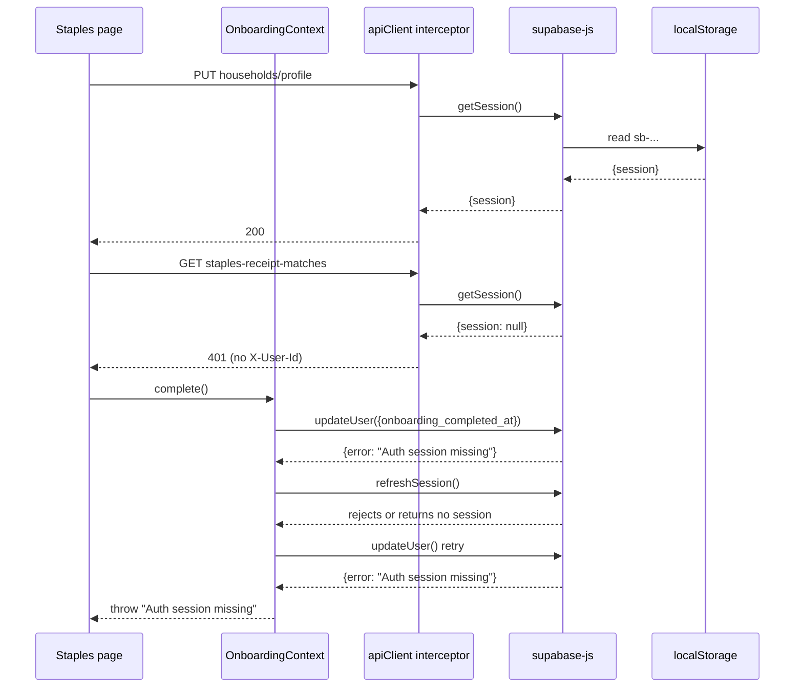

# Pantry onboarding — "Auth session missing" + intermittent getSession=null

After deploying the OnboardingContext fix that throws on `supabase.auth.updateUser` failure, finishing the staples step on iPad still fails — the surfaced error is "Auth session missing". The same iPad session shows repeated `401 User ID required` for `/api/pantry/staples-receipt-matches`, meaning `supabase.auth.getSession()` returns `null` in the apiClient request interceptor too.

The root cause is **not yet 100% confirmed**. This brief lays out a Phase A diagnostic ship, then a Phase B fix-by-case after the diagnostics speak.

## Symptom (from backend dev-log, 2026-05-05)

```
14:30:34  PUT /api/households/profile      200    (auth header present)
14:30:34  GET /api/pantry/staples-receipt-matches   401  {"error":"User ID required"}
14:30:34  [apiClient] axios GET .../staples-receipt-matches status=401 ... resolution={..., source:"supabase"}
14:30:37  POST /api/pantry/confirm-staples 200    (auth header present)
14:30:42  GET /api/pantry/staples-receipt-matches   401
14:30:43  POST /api/pantry/confirm-staples 200
14:30:46  POST /api/pantry/confirm-staples 200
14:30:50  GET /api/pantry/staples-receipt-matches   401
14:30:58  GET /api/pantry/staples-receipt-matches   401
14:31:06  GET /api/pantry/staples-receipt-matches   401
14:31:14  GET /api/pantry/staples-receipt-matches   401
```

Two things are simultaneously true on the same screen:

- `confirm-staples` POSTs succeed (auth headers present, 200).
- `staples-receipt-matches` GETs all 401 with `"User ID required"`, meaning the request interceptor produced a request with **no** `X-User-Id` and no `Authorization` header.

User taps "Done" three times in 9 seconds (3x `confirm-staples` 200s). Each tap also calls `complete()`, which calls `supabase.auth.updateUser(...)`. The deployed fix:

```196:240:frontend/src/contexts/OnboardingContext.jsx
const complete = useCallback(
  async (extra = {}) => {
    if (authLoading) return
    if (completionSentRef.current) return
    completionSentRef.current = true
    ...
    let { data, error } = await doUpdate()
    const looksSessionish =
      Boolean(error) &&
      /session|jwt|expired|auth|token|refresh/i.test(error.message || String(error.code || ''))
    if (looksSessionish) {
      try { await supabase.auth.refreshSession() } catch { /* retry updateUser anyway */ }
      ;({ data, error } = await doUpdate())
    }
    const completedAt = data?.user?.user_metadata?.onboarding_completed_at
    if (error || !completedAt) {
      completionSentRef.current = false
      throw new Error(error?.message || 'Could not finish setup. Please try again.')
    }
  },
  [authLoading, getSignupMethod]
)
```

Three explanations remain in play:

1. `refreshSession()` itself rejects because there is no refresh token in storage (or it cannot be read).
2. The error string didn't match the `looksSessionish` regex on the **first** call, so we fell straight through without retrying.
3. The session is missing in supabase-js memory but present in storage (a read/lock race). `confirmStaples`'s interceptor happens to win the race; `updateUser` and the `staples-receipt-matches` poll lose it.

Notable gap: `frontend/src/services/supabaseClient.js` constructs the client with no auth options:

```1:7:frontend/src/services/supabaseClient.js
import { createClient } from '@supabase/supabase-js'

export const supabase = createClient(
  import.meta.env.VITE_SUPABASE_URL,
  import.meta.env.VITE_SUPABASE_ANON_KEY
)
```

No explicit storage adapter, no `flowType`, no lock override. iOS WKWebView ships `localStorage` and `Web Locks`, but supabase-js's default lock has known issues during background/foreground transitions on Capacitor — losing the in-memory session while the persisted one stays intact in `localStorage`.




## Phase A — diagnostics (ship first, alone)

We need three independent data points before changing any auth wiring.

### A1. Wide-context dev-log inside `complete()`

In [frontend/src/contexts/OnboardingContext.jsx](../frontend/src/contexts/OnboardingContext.jsx), wrap the existing flow so we POST to `/dev/log` (re-using the bridge logger or a small inline `fetch`) capturing:

- `error.message`, `error.code`, `error.status`, `error.name` (for both the first and the retry attempt).
- Result of `await supabase.auth.getSession()` immediately after the first failure: `{hasSession, hasUser, expiresAt, accessTokenLen, refreshTokenLen}` — never the tokens themselves.
- Result of `await supabase.auth.getUser()` immediately after the first failure: `{hasUser, error}`.
- Whether `looksSessionish` matched (boolean), and whether `refreshSession()` rejected, returned `{session: null}`, or returned `{session: present}`.

This single dev-log line per failure tells us which of (1)/(2)/(3) above is real.

### A2. Interceptor visibility

In [frontend/src/services/apiClient.js](../frontend/src/services/apiClient.js) request interceptor, when `await supabase.auth.getSession()` returns no session, also POST `[apiClient] no-session for METHOD URL`. Cheap, one line.

That converts the `staples-receipt-matches` 401 spam into a paper trail of "interceptor saw no session at T=N". Pair the timestamps with the `complete()` failure and we can prove whether the misses are correlated (constant) or burst-ish (race).

### A3. AuthContext events

In [frontend/src/contexts/AuthContext.jsx](../frontend/src/contexts/AuthContext.jsx) `onAuthStateChange`, dev-log every event with the event name + redacted user id:

```
[Auth] onAuthStateChange event=TOKEN_REFRESHED hasSession=true uid=948c4101...
```

If a `SIGNED_OUT` fires between `confirmStaples` (200) and `complete()` ("Auth session missing"), we instantly know storage was cleared. If we never see it, the session "death" is purely in-memory.

### A4. Document the supabase client gap (no code change)

Note that [frontend/src/services/supabaseClient.js](../frontend/src/services/supabaseClient.js) uses defaults: no `auth.storage` (Capacitor `Preferences` would survive WebView storage scrubs better), no `auth.lock` override (default Web Locks lock can wedge in iOS WKWebView), no `flowType` ("pkce" is recommended for native). This is the most likely fix surface in Phase B.

## Phase B — fix by case

After Phase A logs, choose the matching branch.

### Case B1 — `getSession` returns null because storage was cleared / never persisted

Symptom: A3 shows a `SIGNED_OUT` between successful and failed calls **or** A1 shows `accessTokenLen=0` and `refreshTokenLen=0`.

Fix: pass an explicit storage adapter to `createClient`. Capacitor `Preferences` is already a dependency:

```js
// supabaseClient.js sketch
import { Preferences } from '@capacitor/preferences'

const capStorage = {
  getItem: async (k) => (await Preferences.get({ key: k })).value,
  setItem: async (k, v) => Preferences.set({ key: k, value: v }),
  removeItem: async (k) => Preferences.remove({ key: k }),
}

export const supabase = createClient(URL, KEY, {
  auth: {
    storage: capStorage,
    autoRefreshToken: true,
    persistSession: true,
    detectSessionInUrl: false, // native deep-link is handled separately
  },
})
```

Note: switching storage **invalidates existing sessions**. Plan for one forced re-login on first install of the fix.

### Case B2 — Access token expired and refresh fails / never runs

Symptom: A1 shows `expiresAt` in the past and `refreshSession()` rejects with `Auth session missing` or `Refresh token not found`.

Fix:

- Confirm `auth.autoRefreshToken: true` (the default, but make it explicit).
- Wire `App.addListener('appStateChange', ...)` in [frontend/src/main.jsx](../frontend/src/main.jsx) (already present for `refreshSyncedApiBaseUrl`) to also call `supabase.auth.startAutoRefresh()` on resume and `stopAutoRefresh()` on suspend. Without this, the refresh loop dies when iOS suspends the WebView.

### Case B3 — Error string didn't match the regex

Symptom: A1 shows `looksSessionish=false` despite a clearly auth-related error (`AuthSessionMissingError`, `AuthApiError`, status 401).

Fix: broaden the predicate in `complete()` to also match by class / status:

```js
const looksSessionish =
  Boolean(error) && (
    error.name === 'AuthSessionMissingError' ||
    error.status === 401 ||
    /session|jwt|expired|auth|token|refresh|missing/i.test(
      error.message || String(error.code || '')
    )
  )
```

And **always** attempt one `refreshSession()` before giving up, regardless of the predicate.

### B-Common — make `complete()` recoverable even when all retries fail

[frontend/src/pages/onboarding/StaplesTemplate.jsx](../frontend/src/pages/onboarding/StaplesTemplate.jsx) already surfaces `e.message` from the previous patch, so the user sees "Auth session missing" instead of being silently stranded. Add two affordances next to the inline error:

- **"Try again"** button — clears `submitting`, lets user re-tap (cheap retry path; covers transient races).
- **"Sign out and back in"** button — calls `signOut()` from `AuthContext` and routes to `/auth`. Last-resort escape hatch when storage is genuinely broken.

## Validation

### Phase A success criteria

After shipping Phase A and re-running onboarding on iPad:

- We capture at least one of:
  - `[OnboardingComplete] ... getSession.hasSession=false getUser.hasUser=false` -> Case B1.
  - `... refreshSession rejected ... message=...` -> Case B2 or B3.
  - `... looksSessionish=false errorName=AuthSessionMissingError` -> Case B3.
  - `[Auth] onAuthStateChange event=SIGNED_OUT` between successful and failed calls -> Case B1.
- The interceptor `[apiClient] no-session` dev-log lines and the `complete()` failure log have correlated timestamps.

### Phase B success criteria (after the matching fix)

- `staples-receipt-matches` returns 200 throughout the staples step (no 401s).
- `complete()` succeeds on first tap; user is routed to `/`.
- After force-quit + relaunch, the user lands directly on `/` (not `/auth`), proving session persisted.
- After 60+ minutes idle then resume, an automatic `TOKEN_REFRESHED` event fires before the next API call.

