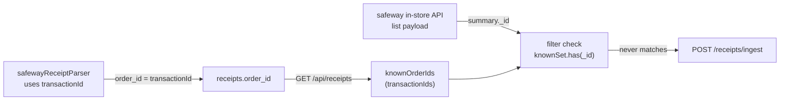

# Safeway sync — every receipt rejected as duplicate

After a successful Safeway login + token extraction, every receipt the in-store API returns is re-submitted to the backend on every sync. Backend rejects each one with `duplicate key value violates unique constraint "receipts_order_id_key"`.

## Symptom (from backend dev-log, 2026-05-05)

```
14:06:38  GET /api/receipts?user_id=...&limit=100   200
14:06:38  [safewayLogin] startLogin opening url=https://www.safeway.com/
14:06:55  [safewayLogin] tokens_ready {"hasToken":true,"hasClub":true}
14:06:57  Storing receipt 002734177000391775409874847 ...
14:06:57  ERROR Failed to store receipt with items: duplicate key value violates unique constraint "receipts_order_id_key"
14:06:57  INFO  Receipt 002734177000391775409874847 already exists in database - skipping duplicate
... (13 more receipts, all duplicates)
14:06:59  POST /api/receipts/ingest 200
```

User-visible result: sync "succeeds" but `items_added_to_pantry` is 0 and `receipts_stored` is 0. The pre-fetch at 14:06:38 to populate `knownOrderIds` is firing, but the client-side filter is not excluding the receipts.

## Root cause

The id used to look up "have we seen this receipt before?" does **not** match the id the parser writes into `order_id`.

Parser (Safeway -> backend payload):

```106:111:frontend/src/services/safewayReceiptParser.js
const receiptId = detail._id ?? detail.id ?? fallback._id ?? fallback.id ?? '';
const orderId =
  detail.transactionId ?? fallback.transactionId ?? receiptId ?? 'unknown';

return {
  order_id: orderId,
  ...
};
```

Priority: `transactionId` first, fall back to `_id`/`id`. The backend `receipts.order_id` column therefore holds `transactionId` for almost every receipt.

Dedup filter (in-store API summaries -> kept-set):

```155:171:frontend/src/services/safewayApiFetcher.js
const knownSet = new Set((knownOrderIds || []).map(String));
const cutoff = Date.now() - daysOverride * 24 * 60 * 60 * 1000;

const filtered = list.filter((r) => {
  const id = r._id || r.id || r.transactionId || '';
  if (knownSet.size && id && knownSet.has(String(id))) return false;
  ...
});
```

Priority: `_id` first, fall back to `id`/`transactionId`. So the filter compares the summary's `_id` against a set of `transactionId`s. They never match.

`useSafewaySync` populates `knownOrderIds` from the backend response:

```82:86:frontend/src/hooks/useSafewaySync.js
const { receipts } = await api.getReceipts(userId, 100);
knownOrderIds = (receipts || [])
  .filter((r) => r?.provider === 'safeway' && r?.order_id)
  .map((r) => r.order_id);
```

So `knownOrderIds` = list of `transactionId`s. Every summary's `_id` is missing from that set, every receipt passes the filter, every receipt is re-fetched in detail, re-submitted, and rejected by the unique constraint.



## Fix

### 1. Align id resolution with the parser

In [frontend/src/services/safewayApiFetcher.js](../frontend/src/services/safewayApiFetcher.js), change the dedup id and the receipt-id-for-detail-fetch to match parser priority:

```js
// before
const id = r._id || r.id || r.transactionId || '';
// after
const id = r.transactionId || r._id || r.id || '';
```

Apply the same priority where `receiptId` is computed for the detail call (line ~198):

```js
// before
const receiptId = summary._id || summary.id || '';
// after
const receiptId = summary.transactionId || summary._id || summary.id || '';
```

### 2. Add a one-line filter visibility log

Right after the `filter` and the existing `dispatchProgress('list_fetched', 0, filtered.length)`:

```js
dispatchProgress('list_filtered', filtered.length, list.length);
```

That makes "we fetched N, filtered to M" visible in the UI progress and (transitively) in `webview-progress` listeners. Optional but cheap.

### 3. (Defensive, only if needed) belt-and-suspenders backend dedup

The backend already swallows duplicate-key errors in `store_fetched_receipts` ([backend/services/receipt_service.py](../backend/services/receipt_service.py#L282-L289)) — no change needed there. The error logs are loud but the user impact is just wasted bandwidth and AI parsing budget.

## Validation

1. Fresh sync after fix:
   - Backend log shows the same `GET /api/receipts?limit=100` pre-fetch.
   - Followed by `tokens_ready`.
   - Followed by **zero** `Storing receipt ...` lines if no new receipts were posted to Safeway since the last sync.
   - `POST /api/receipts/ingest 200` with `receipts_stored: 0` and `items_added_to_pantry: 0`.
2. After buying something new at Safeway, next sync stores exactly the new receipts (no duplicate-key errors).
3. UI progress shows `list_filtered` step (if dispatched).
